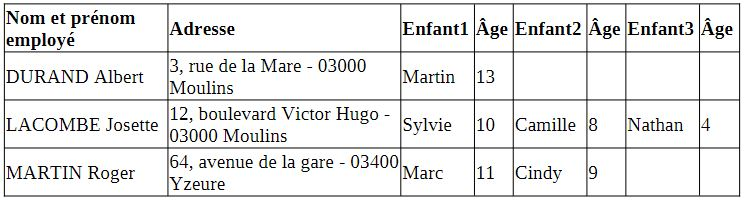
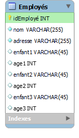

# Création de MCD #

Le but de ces exercices est de créer des diagrammes de base de données.

Vous pouvez utiliser le type de diagramme que vous préférez, MCD, MLD ou bien ER, Merise.

La plupart de ces exercices verront leur corrections données aux formats MCD et MLD.

## 01. Rock & Roll ##

Un fan de rock souhaite créer un site consacré à ses groupes préférés. Il doit donc tenir l'inventaire des disques, avec pour chacun d'eux le titre, l'artiste, le label et l'année.
En ce qui concerne les groupes et les musiciens, une analyse fine montre que le problème est redoutable :

On se contentera ici d'une approche simple.

On traitera successivement de deux hypothèses :

1. la discothèque ne comprend aucune compilation de différents artistes
2. la discothèque comprend des compilations.

Etablir le diagramme dans ces deux cas.

## 2. Commité d'Entreprise ##

Un comité d'entreprise souhaite gérer les informations concernant les enfants de ses salariés.

Un employé a réalisé le tableau suivant :

;

Il pense le placer en BDD sous cette forme :
;

- Quelles critiques peut-on adresser à cette solution ?
- Quelles propositions peut-on faire pour adopter une solution plus adéquate ?

Réaliser le diagramme adéquat.

## 03. Casse Automobile ##

Une casse automobile souhaite gérer son stock de pièces.
Chaque pièce est identifiée par une référence, une catégorie (carosserie, mécanique, électricité, etc.), une date de récupération et un prix de vente.
On souhaite également pouvoir établir une correspondance entre les pièces et les véhicules pour lesquels elles conviennent, ces véhicules étant repérés par marque, modèle et année.

Etablir le diagramme adéquat dans les deux hypothèses suivantes :

1. toutes les pièces d'une même référence possèdent un prix unique
2. chaque pièce possède un prix propre.

## 04. Bibliothèque ##

Une bibliothèque de prêt dispose d'un certain nombre d'ouvrages, classés par rayon (Littérature, Histoire, Géographie, etc.).
Chaque ouvrage est l'œuvre d'un ou plusieurs auteurs, et doit également être référencé selon un certain nombre de mots-clés.
Chaque adhérent peut emprunter jusqu'à 5 livres en même temps, et dispose d'un certain délai passé lequel il doit recevoir des relances puis des pénalités.
On se place dans quatre cas successifs, de complexité croissante :

1. la bibliothèque ne possède qu'un seul exemplaire de chaque ouvrage.
    Elle enregistre uniquement les emprunts présents (il n'y a pas d'historique des emprunts passés).
2. la bibliothèque ne possède qu'un seul exemplaire de chaque ouvrage, mais elle tient un historique de tous les emprunts qui ont été effectués.
3. la bibliothèque tient un historique... et elle est maintenant susceptible de posséder plusieurs exemplaires de certains ouvrages
4. en plus de cela, il existe une bibliothèque centrale et des antennes locales.
    Chaque antenne possède un fonds qui lui est propre, et peut de surcroit se procurer certains ouvrages auprès de la bibliothèque centrale (mais pas d'une autre bibliothèque locale).
    Tout adhérent peut automatiquement emprunter des ouvrages dans toutes les antennes locales.

Etablir le diagramme adéquats dans les quatre cas.

## 5. Histoire ##

Un historien souhaite établir des statistiques sur des soldats de la Première Guerre mondiale.
Pour chaque soldat, outre l'état-civil, il souhaite avoir la trace :

- de la date de son décès si celui-ci est survenu suite aux combats
- des blessures reçues (type et date de la blessure, en plus de la bataille où elle a été infligée. Les batailles seront référencées dans une liste comportant le lieu, les dates de début et de fin)
- des grades obtenus (avec les dates)
- de l'unité de rattachement (avec les dates)

Etablir le diagramme adéquats.

## 6. Club ##

Un club sélect désire informatiser le fichier de ses membres.
Pour chacun d'eux, outre les informations d'état-civil ordinaires, on souhaite tenir à jour les commissions de rattachement et en tenir l'historique (il existe une liste de commissions, et chaque membre peut librement intégrer - et quitter - autant de commissions qu'il le souhaite).
Par ailleurs, le recrutement du club fonctionne sous forme de parrainage :
> un membre ordinaire ne peut le rejoindre que s'il a été parrainé par trois autres membres.
> On souhaite là aussi conserver l'historique, et pouvoir retrouver qui a parrainé qui et à quelle date.
Certains membres n'ont cependant jamais été parrainés :
>ils sont qualifiés de "fondateurs".

Etablir le diagramme adéquat.

## 7. Aquarium ##

Un aquarium souhaite gérer ses petites bêtes.
Il dispose pour cela de plusieurs bassins, répartis
dans plusieurs pièces.
Des animaux de différentes espèces sont achetés, immatriculés, et disposent d'un suivi médical personnalisé - on garde donc la trace de la date et de la nature des soins dont ils bénéficient.
Les animaux sont mélangés dans les bassins, et il arrive qu'on les déplace - là encore, on souhaite savoir à quelle date un animal donné a quitté tel bassin pour être placé dans tel autre.

Les biologistes classent les animaux selon une arborescence à quatre niveaux.
De plus général au particulier : ordre, famille, genre, espèce.
Il va de soi que chaque animal de l'aquarium doit
être correctement identifié dans cette arborescence.

Etablir le diagramme adéquats.

## 8. Rock & Roll (Difficile) ##

On reprend le problème de la CDthèque, en s'attelant cette fois pour de bon à la question des artistes ayant signé les disques.
Un disque peut avoir été signé par un groupe, par un individu, ou par plusieurs.
Les groupes sont naturellement formés d'individus, dont on note de surcroît quels instruments ils jouent.
Et en plus, sur un CD, il peut y avoir des guest-stars, qui sont venus jouer sans pour autant être signataires du disque.
Pour ajouter à la difficulté, un même individu peut à la même époque avoir participé à un (ou plusieurs) groupes, et avoir collaboré à un (ou plusieurs) disques en tant qu'invité.
Bref, il faut prévoir toutes les situations possibles et pouvoir restituer toutes les informations, qu'elles soient relatives aux disques, aux groupes, à leurs membres, à l'historique de chaque instrumentiste, etc.

Etablir le diagramme adéquat.

On réalisera deux versions successives de cet exercice.
L'une, en plaçant les groupes et les musiciens dans deux entités distinctes. L'autre, en les réunissant dans une entité unique.
