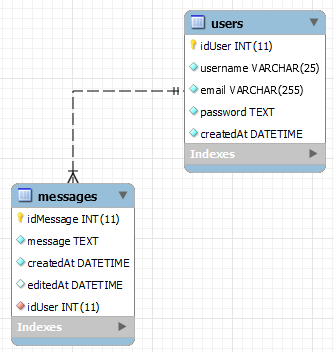
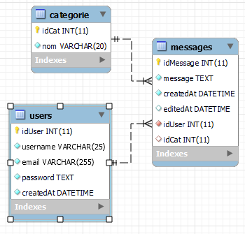

# Partie 1 : Messages du blog #

Nous allons créer tout le crud pour les messages de nos utilisateurs.  
Dans le fichier "02-read.php" nous avons un lien "voir" qui ne nous mène à rien pour l'instant.  

Notre but va être d'afficher tous les messages de l'utilisateur sur lequel on a cliqué.

1. créer une table en BDD, elle devra suivre la structure suivante :
    - idMessage Int AI PK NOT NULL
    - message text  NOT NULL
    - createdAt datetime default timestamp NOT NULL
    - editedAt datetime default NULL
    - idUser Int FK Delete cascade Update Cascade NOT NULL

    

2. Créer un fichier "read.php" où l'on fera ce qui suit :
    - Une redirection si aucun id n'a été fourni en get.
    - Afficher la liste de tous les messages de l'utilisateur fourni en get.  
        Ou un texte indiquant qu'il n'y en a aucun.
    - Si l'utilisateur actuellement connecté vient sur sa page,  
        chaque message sera accompagné de boutons "update" et "delete".  
    - Toujours dans le même cas, on affichera un formulaire d'ajout de nouveau message.  
        Celui ci redirigera vers la page "create.php"
    - On vérifiera aussi si il y a un flash message et on l'affichera.

3. Créer un fichier "create.php" où l'on fera ce qui suit :
    - Une redirection si on n'est pas connecté.
    - On traitera le formulaire d'envoi de message venant de "read.php".
    - On ajoutera un flash message indiquant la réussite ou l'échec de l'envoi.  
        Puis on redirigera l'utilisateur vers "read.php".

4. Créer un fichier "update.php" où l'on fera ce qui suit :
    - Une redirection si on n'est pas connecté.
    - Une redirection si on n'a pas d'id en get
    - Une redirection si l'utilisateur connecté n'est pas le propriétaire du message.
    - Afficher un formulaire d'édition du message.
    - Traiter le formulaire. (on pensera à mettre à jour le champ "editedAt").
    - Rediriger vers "read.php" avec un flash message.

5. Créer un fichier "delete.php" où l'on fera ce qui suit :
    - Une redirection si on n'est pas connecté.
    - Une redirection si on n'a pas d'id en get
    - Une redirection si l'utilisateur connecté n'est pas le propriétaire du message.
    - Supprimer le message sélectionné si l'utilisateur connecté en est bien le propriétaire.
    - Rediriger l'utilisateur vers la liste des messages accompagné d'un flash message.

## Partie 2 : Ajout des catégories ##

On va maintenant ajouter un choix de catégorie pour nos messages :

1. Créer une table "Category" telle que :
    - idCat int PK AI NOT NULL
    - nom varchar(20) NOT NULL
    - On ajoutera ensuite manuellement quelques catégories.

2. On va modifier la table "messages" telle que :
    - idCat int FK on delete set null on update cascade

    

3. On va mettre à jour "read.php" telle que :
    - la catégorie des messages va être affiché.
    - On pourra sélectionner une catégorie et afficher tous les messages de cette catégorie pour le blog sur lequel on se trouve.
    - le formulaire d'ajout des messages va permettre la selection de catégorie.

4. On va mettre à jour "create.php" pour permettre l'ajout de catégorie.

5. On va mettre à jour "update.php" pour permettre la modification de catégorie.
